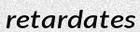
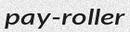
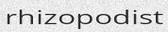
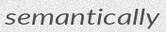
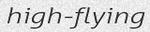
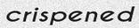

# CRNN

A TensorFlow implementation of https://github.com/bgshih/crnn

## But what is a CRNN?

It is a Convolutional Recurrent Neural Network that can be used as an OCR

## Requirements

- Tensorflow (tested with 1.8) `pip3 install tensorflow`
- Scipy `pip3 install scipy`

## What training data was used?

All training data (200 000 examples) were generated using my other project https://github.com/Belval/TextRecognitionDataGenerator

To do the same, simply clone that project and do `python3 run.py -c 200000 -w 1 -t 8`. `-t` should be your processor thread count.

## Pretrained model

Available in CRNN/save. Use `python3 run.py -ex ../data/test --test --restore` to test.

## Results

It works but is a suboptimal solution for OCR in its current form as it makes some mistakes. Do note that I used a bigger char vector than the paper.

For fun, here are a list of words with their prediction:

| Ground truth 	| Prediction 	| Image 	|
|--------------	|------------	|-------	|
| retardates 	| retardates 	|  	|
| pay-roller 	| poy-roler 	|  	|
| rhizopodist | rhizospodist |  	|
| theriacas | trenagas |  	|
| semantically | semanticaly |  	|
| dualistic | duaistic |  	|
| high-flying | highi-fling |  	|
| grossify | grsity |  	|
| scutular | scutular |  	|
| crispened | crispened |  	|
